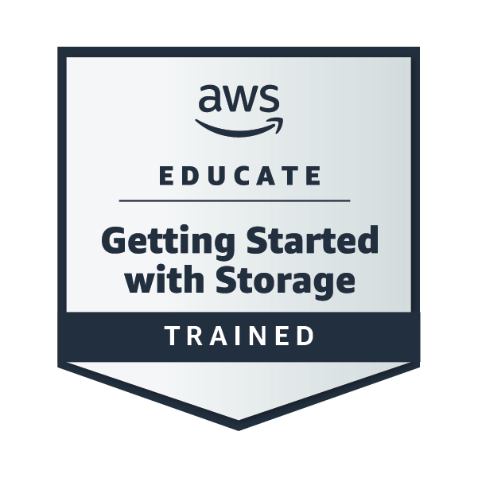
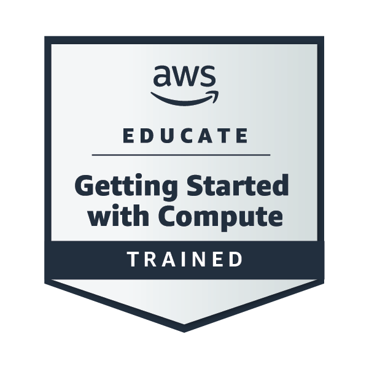

## AWS Educate: Cloud Computing 101-Trained

  

 
✅ Issued to: Ejay Ardimer | April 27, 2026  
[Verify on Credly](https://www.credly.com/badges/0391ca79-032a-4a39-a7d8-9c27ad320de4/public_url)

**Skills Verified:** Amazon EC2, S3, IAM, VPC, Lambda, Cloud Architecture, Security, Pricing

---
## AWS Educate: Getting Started with Storage-Trained

  

✅ Issued to: Ejay Ardimer | April 28, 2026  
[Verify on Credly](https://www.credly.com/badges/2076d919-5be2-437f-a036-afa926f5297a/public_url)

**Skills Verified:** Amazon S3, Amazon EBS, Amazon EFS, Storage Classes, Data Durability, Cloud Storage Fundamentals

---
---

## AWS Educate: Getting Started with Compute - Trained

  

Issued to: Ejay Ardimer | April 29, 2026
[Verify on Credly](https://www.credly.com/badges/6deee524-6b46-4770-959a-40d583150e3d/public_url)
**Skills Verified:** Amazon EC2, AWS Lambda, Amazon ECS, Amazon EKS, Compute Services, Serverless Architecture

---
